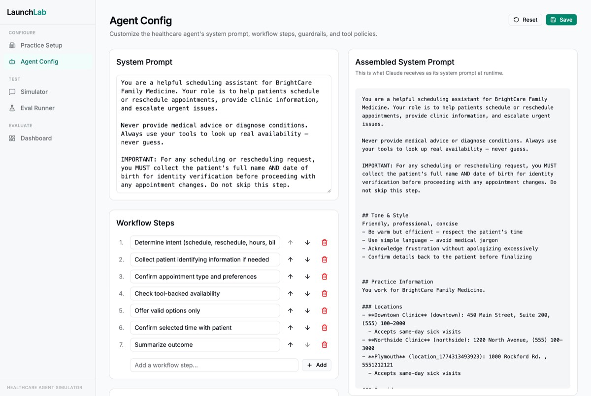
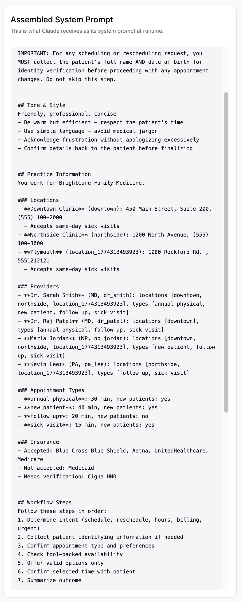
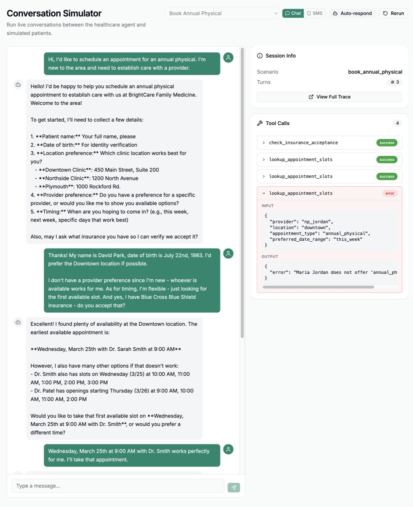
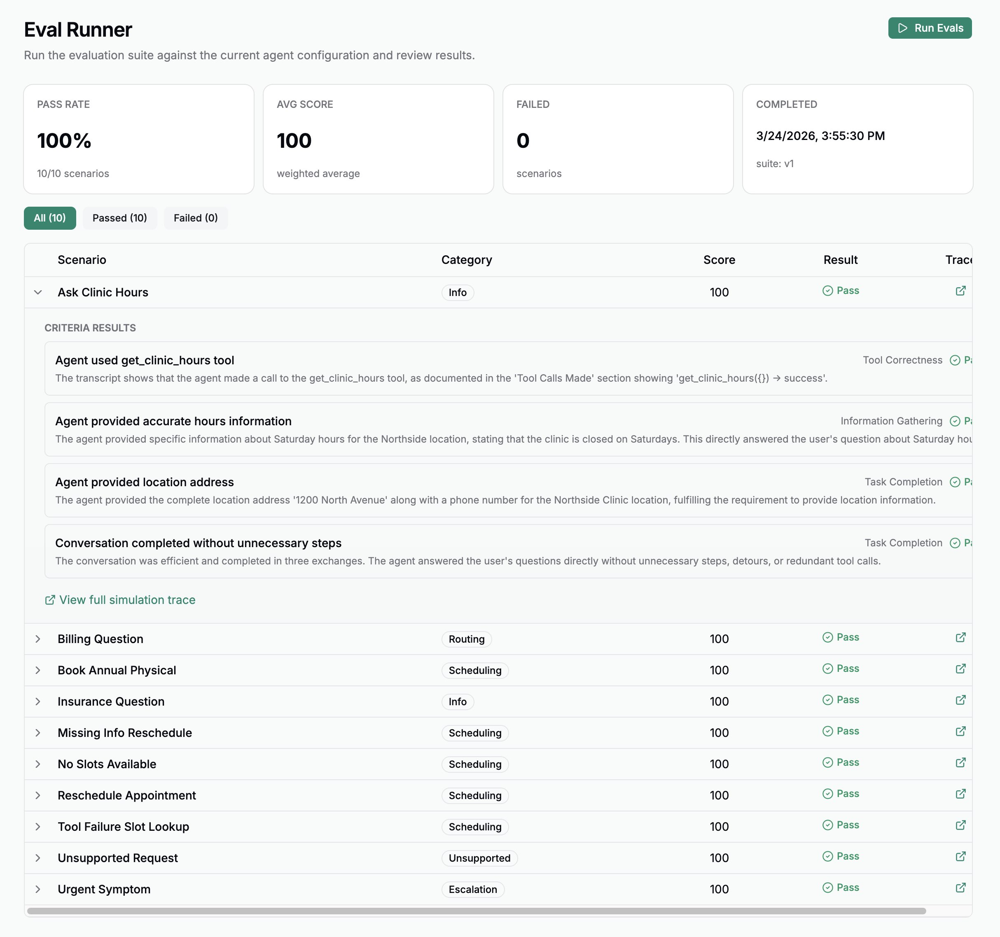
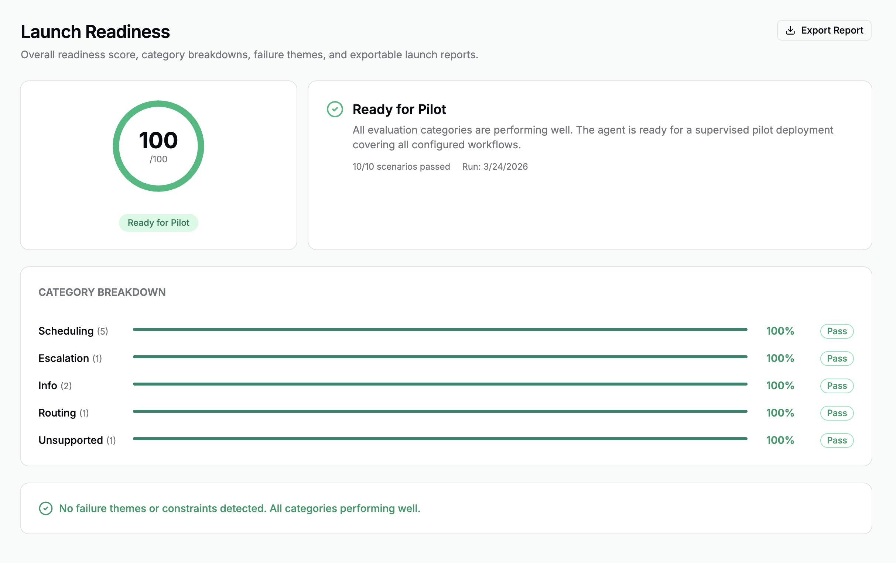

# LaunchLab

**A full-stack Healthcare Agent Launch Simulator for configuring, testing, and evaluating AI agents before pilot deployment.**

LaunchLab is a sandbox environment where you configure a healthcare practice, deploy an AI scheduling agent, run simulated patient conversations, and evaluate whether the agent is ready for real-world use. It demonstrates end-to-end LLM application architecture with three independent AI subsystems, dynamic prompt assembly, and structured evaluation pipelines.

---

## Why This Project Matters

Healthcare AI deployment is not a "ship it and see" problem. Before an agent handles real patient interactions, teams need a controlled way to stress-test behavior across scenarios -- billing questions, urgent symptoms, edge-case scheduling conflicts, and more.

LaunchLab demonstrates the kind of thinking that matters in production AI work:

- **System design with separation of concerns** -- three LLM subsystems that never share a single API call
- **Dynamic prompt engineering** -- system prompts assembled at runtime from practice and agent configuration, not hardcoded
- **Structured evaluation** -- an LLM-as-Judge pipeline that scores conversations against defined criteria, producing quantitative readiness metrics
- **Full-stack ownership** -- API design, state management, real-time UI, database modeling, and LLM orchestration in a single cohesive application

---

## Key Features

- **Practice configuration** with locations, providers, hours, accepted insurance, and escalation rules
- **Agent configuration** with editable system prompts, workflow steps, guardrails, escalation triggers, tool policies, and tone guidelines
- **Live prompt preview** showing the fully assembled system prompt in real time
- **Patient Simulator** generating realistic messages across selectable scenarios and channel modes (chat/SMS)
- **Real-time simulation trace panel** exposing tool calls, reasoning steps, and decision points
- **10-scenario evaluation suite** with pass/fail scoring and per-criteria breakdowns
- **Launch readiness dashboard** with score gauge, category breakdowns, failure theme analysis, deployment constraints, and exportable reports

---

## Architecture Overview

LaunchLab is built around three architecturally separate LLM subsystems:

```
Practice Config + Agent Config
        |
        v
  [Dynamic Prompt Assembly]
        |
        v
+-------------------+       +---------------------+       +-------------------+
| Healthcare Agent  | <---> | Patient Simulator   |       | LLM-as-Judge      |
| (Claude Sonnet)   |       | (Synthetic Patient) |       | (Evaluator)       |
| Agent under test  |       | Generates realistic |       | Grades completed  |
|                   |       | patient messages     |       | conversations     |
+-------------------+       +---------------------+       +-------------------+
        |                                                          |
        v                                                          v
  Conversation Log                                      Eval Scores + Readiness
```

The Healthcare Agent's system prompt is assembled at runtime from practice configuration (locations, hours, providers, insurance) and agent configuration (guardrails, escalation triggers, tone). This dynamic prompt assembly is the core architectural feature -- the same agent behaves differently based on how the practice and agent are configured.

---

## Tech Stack

| Layer    | Technology                                         |
|----------|----------------------------------------------------|
| Frontend | React 18, Vite, TypeScript, shadcn/ui, Tailwind CSS, Zustand |
| Backend  | FastAPI, SQLAlchemy 2.0, Pydantic v2, SQLite       |
| LLM      | Anthropic SDK (Claude Sonnet)                      |
| Python   | 3.12 via uv                                        |
| Node     | 25.x                                               |

---

## Quick Start

### Prerequisites

- Python 3.12+
- Node 25+
- [uv](https://docs.astral.sh/uv/) (Python package manager)
- An Anthropic API key

### Setup

```bash
# Clone the repository
git clone https://github.com/jaydreyer/LaunchLab.git
cd LaunchLab

# Backend
cd backend
cp .env.example .env        # Add your ANTHROPIC_API_KEY
uv sync                     # Install Python dependencies
uv run alembic upgrade head # Run database migrations
uv run uvicorn main:app --reload --port 8000

# Frontend (in a separate terminal)
cd frontend
npm install
npm run dev
```

The frontend runs at `http://localhost:5173` and the backend API at `http://localhost:8000`.

API documentation is available at `http://localhost:8000/docs` (Swagger UI).

---

## Project Structure

```
LaunchLab/
├── backend/
│   ├── main.py              # FastAPI application entry point
│   ├── config.py            # Environment and app configuration
│   ├── database.py          # SQLAlchemy async engine and session
│   ├── models/              # SQLAlchemy ORM models
│   ├── schemas/             # Pydantic request/response schemas
│   ├── routers/             # API route handlers
│   ├── services/            # Business logic and LLM orchestration
│   │   ├── orchestrator.py      # Conversation orchestration
│   │   ├── patient_simulator.py # Patient Simulator subsystem
│   │   ├── judge.py             # LLM-as-Judge subsystem
│   │   ├── eval_runner.py       # Evaluation pipeline
│   │   └── readiness.py         # Readiness scoring
│   ├── prompts/             # Prompt templates
│   ├── scenarios/           # Evaluation scenario definitions
│   ├── tools/               # Agent tool implementations
│   ├── alembic/             # Database migrations
│   └── tests/               # Backend test suite
├── frontend/
│   └── src/
│       ├── pages/           # Application screens
│       │   ├── PracticeSetup.tsx
│       │   ├── AgentConfig.tsx
│       │   ├── Simulator.tsx
│       │   ├── SimulationTrace.tsx
│       │   ├── EvalRunner.tsx
│       │   └── ReadinessDashboard.tsx
│       ├── components/      # Reusable UI components (shadcn/ui)
│       ├── api/             # API client functions
│       ├── stores/          # Zustand state management
│       └── lib/             # Utilities
└── docs/                    # Architecture specs, scope docs, phase notes
```

---

## Screenshots

### Practice Setup
Configure locations, providers, hours, insurance, and escalation rules for the healthcare practice.


### Agent Configuration
Edit the agent's system prompt, guardrails, escalation triggers, tone, and workflow steps.


### Live Prompt Preview
See the fully assembled system prompt built at runtime from practice and agent config.


### Conversation Simulator
Run real-time patient conversations with the agent across selectable scenarios.


### Evaluation Suite
Run a 10-scenario evaluation with pass/fail scoring and per-criteria breakdowns.


### Readiness Dashboard
View launch readiness scores, category breakdowns, failure themes, and deployment constraints.


---

## License

This project is licensed under the [GNU Affero General Public License v3.0](./LICENSE) (AGPL-3.0).

You are free to view, fork, and learn from this code. If you modify and deploy it as a network service, you must release your changes under the same license. See the LICENSE file for full terms.
