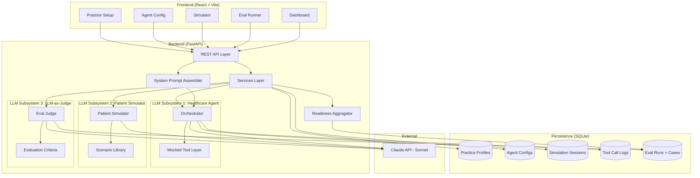
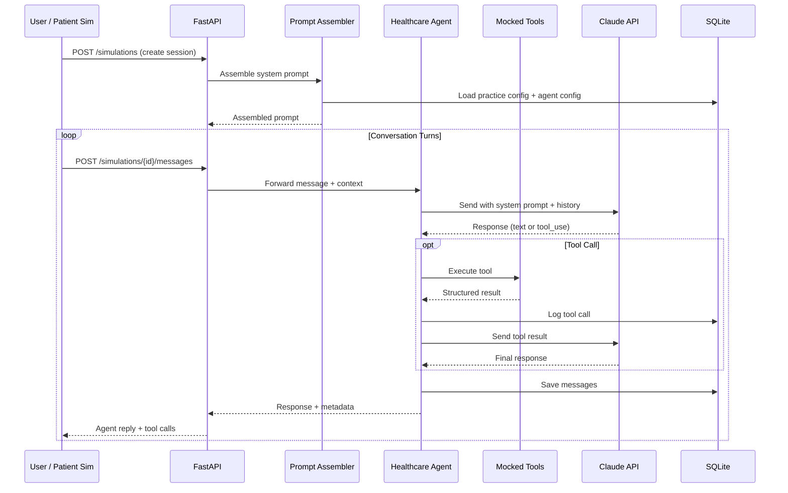
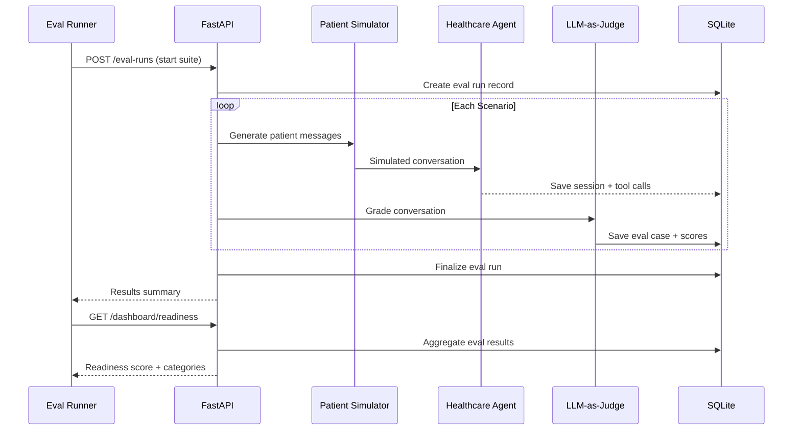

# LaunchLab Architecture Diagram

## System Overview

## Data Flow: Simulation Session

## Data Flow: Evaluation Pipeline

## Key Architectural Decisions

| Decision | Rationale |
|----------|-----------|
| Three separate LLM calls | Keeps agent, simulator, and judge independent — no prompt contamination |
| Dynamic prompt assembly | Practice config changes automatically update agent behavior |
| Mocked tools | Proves orchestration pattern without real EMR integration |
| SQLite | Zero-config persistence, sufficient for single-user portfolio project |
| Scenario-based evaluation | Each scenario has its own criteria, not a one-size-fits-all rubric |
